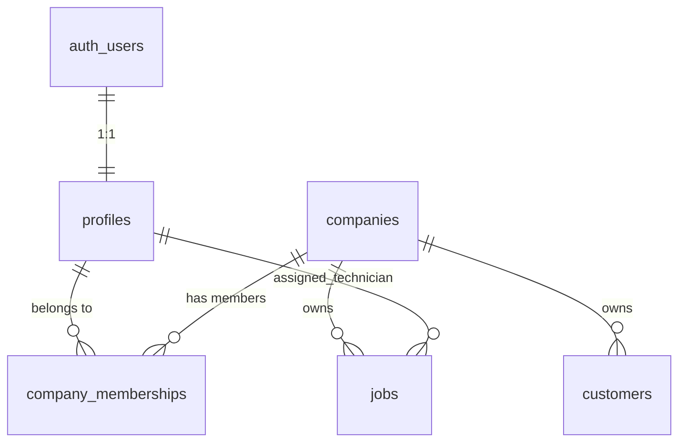
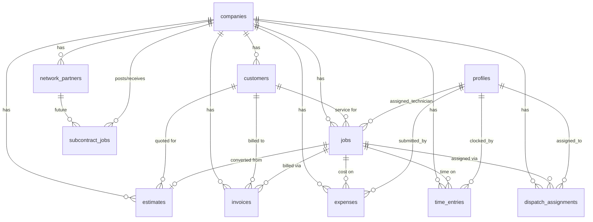
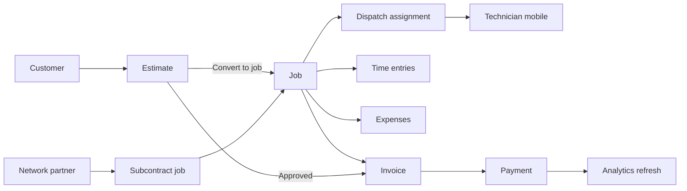

# Altair OS — Backend Data Map

> **Purpose:** Map every existing frontend module and its mock data to the backend schema required for a production trades SaaS platform.  
> **Status:** Planning document only — no app behavior changes, mock data preserved, no new SQL in this pass.  
> **Sources audited:** `shared/types/*`, `shared/data/mock-*.ts`, `shared/components/*`, `app/(admin)/*`, `app/tech/*`, `supabase/migrations/001_core_auth.sql`, `supabase/migrations/002_app_core.sql`, `lib/database/types/roles.ts`.

---

## Executive Summary

All ten product modules are **client-side mock prototypes** today. They share a consistent UI pattern (list + detail panel + create form + summary cards) but have **no Supabase queries wired**. Migration `002_app_core.sql` already defines tables for most core entities; gaps remain for **Network subcontract jobs**, **invoice payments**, **technician availability**, **job photos/notes**, **partner invites**, and **analytics aggregates**.

| Module | Route | Mock source | DB tables (existing) | DB gaps |
|--------|-------|-------------|----------------------|---------|
| Customers | `/customers` | `mock-customers.ts` | `customers` | Denormalized stats need triggers/views |
| Jobs | `/jobs` | `mock-jobs.ts` | `jobs` | Technician FK vs free-text name |
| Estimates | `/estimates` | `mock-estimates.ts` | `estimates` | `sent_at`, tax rate config |
| Invoices | `/invoices` | `mock-invoices.ts` | `invoices` | `invoice_payments`, send/view tracking |
| Expenses | `/expenses` | `mock-expenses.ts` | `expenses` | Receipt storage bucket + approval workflow |
| Time Clock | `/time` | `mock-time-entries.ts` | `time_entries` | `customer_name` denorm; approval audit |
| Dispatch | `/dispatch` | `mock-dispatch-jobs.ts`, `mock-technicians.ts` | `jobs`, `dispatch_assignments`, `profiles` | `technician_status`, real-time board |
| Technician Mobile | `/tech` | `mock-technician-dashboard.ts` | `jobs`, `time_entries`, `profiles` | Shift state, job actions, photos |
| Network | `/network` | *(live — Supabase)* | `network_profiles`, `network_referrals` | `network_partners` CRM UI, `subcontract_jobs` |
| Analytics | `/reports` | `mock-analytics*.ts` | *(none — read aggregates)* | Materialized views / RPC functions |

---

## Foundation Layer (Already Migrated)

These tables underpin every module. All operational records must carry `company_id` for tenant isolation.



### Core auth & tenancy

| Table | Role in product |
|-------|-----------------|
| `companies` | Tenant root; timezone, settings JSONB for feature flags |
| `profiles` | User identity (extends `auth.users`); `full_name`, `phone`, `avatar_url` |
| `company_memberships` | User ↔ company with `company_role` enum and `membership_status` |

### Company roles (enum `company_role`)

| Role | Intended surfaces |
|------|-------------------|
| `owner` | Full admin, billing, settings, analytics |
| `admin` | Admin command center, all modules |
| `dispatcher` | Dispatch board, job assignment, customers |
| `technician` | `/tech` mobile dashboard, time clock, expenses |
| `office_staff` | Customers, estimates, invoices, expenses approval |
| `subcontractor` | Network module (future partner portal) |
| `customer` | Future customer portal |

Permission keys defined in `lib/database/types/roles.ts`: `manageCompany`, `manageUsers`, `dispatchJobs`, `manageCustomers`, `viewAssignedJobs`, `manageBilling`.

**Current gap:** RLS policies in `002_app_core.sql` allow any active company member full CRUD on all app tables. Role-scoped policies are not yet implemented. Frontend has no route-level auth gates.

---

## Global Entity Relationship Map



### Denormalization strategy

The frontend heavily denormalizes names and numbers for display (`customerName`, `jobNumber`, `technician` as string). In production:

| Frontend field | Backend resolution |
|----------------|-------------------|
| `customerName` | JOIN `customers.name` (or `company_name` for B2B) |
| `jobNumber` | `jobs.job_number` |
| `assignedTechnician` / `technician` | JOIN `profiles.full_name` via `assigned_technician_id` / `technician_id` |
| `customerPhone` (tech mobile) | JOIN `customers.phone` |
| `totalJobs`, `totalRevenue`, `lastServiceDate` on Customer | Computed via aggregate query or maintained by DB trigger on job/invoice events |

Store denormalized counters on `customers` only if updated atomically via triggers; otherwise compute at query time for correctness.

---

## Module Audits

---

### 1. Customers

**Route:** `/customers`  
**Key files:** `shared/types/customer.ts`, `shared/data/mock-customers.ts`, `shared/components/customers/*`

#### Data displayed

| Field | List | Detail | Create form |
|-------|------|--------|-------------|
| `id` | — | — | auto |
| `name` | ✓ | ✓ | ✓ |
| `email` | subtext | ✓ | ✓ |
| `phone` | — | ✓ | ✓ |
| `company` | subtext | ✓ | ✓ |
| `status` | badge | ✓ | ✓ |
| `address`, `city`, `state`, `zip` | location col | ✓ | ✓ |
| `totalJobs` | ✓ | ✓ | — (defaults 0) |
| `totalRevenue` | ✓ | ✓ | — (defaults 0) |
| `lastServiceDate` | ✓ | ✓ | — |
| `tags[]` | — | ✓ | — (defaults []) |
| `notes` | — | ✓ | ✓ |
| `createdAt` | — | "Customer since" | auto |

**Status enum:** `active` | `inactive` (prospects live in the `leads` table, not customer status)  
**Filters:** status dropdown, text search (name, email, phone, company, city, state)

#### Tables required

| Table | Usage |
|-------|-------|
| `customers` | Primary entity |
| `jobs` | Related service history (future detail tab) |
| `estimates` | Related quotes (future detail tab) |
| `invoices` | Revenue source for `totalRevenue` |

#### Relationships

- Customer **1:N** Jobs (`jobs.customer_id`)
- Customer **1:N** Estimates (`estimates.customer_id`)
- Customer **1:N** Invoices (`invoices.customer_id`)

#### Missing backend fields

| Gap | Recommendation |
|-----|----------------|
| `tags text[]` | ✓ Exists on `customers` |
| `total_jobs`, `total_revenue`, `last_service_date` | ✓ Exist; should be **trigger-maintained** or replaced with views |
| Customer service history timeline | New `customer_activity` view or `job_events` table (future) |
| Multiple service locations | Future `customer_locations` table (single address today) |
| Lead source / referral tracking | `leads` table (`lead_source` enum) — see Lead Pipeline module |

#### Role / permission needs

| Action | Roles |
|--------|-------|
| View customers | `owner`, `admin`, `dispatcher`, `office_staff` |
| Create / edit | `manageCustomers` permission |
| Delete | `owner`, `admin` only (with job dependency check) |
| View revenue stats | `manageBilling` or `owner`/`admin` |

#### Real-time (later)

- New lead notifications to office staff
- Customer record updates when job completes (stats refresh via trigger, not necessarily realtime UI)

---

### 2. Jobs

**Route:** `/jobs`  
**Key files:** `shared/types/job.ts`, `shared/data/mock-jobs.ts`, `shared/components/jobs/*`

#### Data displayed

| Field | List | Detail | Create form |
|-------|------|--------|-------------|
| `id` | — | — | auto |
| `jobNumber` | ✓ | ✓ | auto (`JOB-{n}`) |
| `customerId` | — | — | synthetic on create |
| `customerName` | ✓ | ✓ | free text (should be picker) |
| `serviceAddress`, `city`, `state`, `zip` | ✓ | ✓ | ✓ |
| `jobType` | ✓ | ✓ | select (8 predefined types) |
| `assignedTechnician` | ✓ | ✓ | free text (should be picker) |
| `scheduledDate` | ✓ | ✓ | datetime-local |
| `status` | badge | ✓ | ✓ |
| `priority` | badge | ✓ | ✓ |
| `description`, `notes` | — | ✓ | ✓ |
| `createdAt` | — | — | auto |

**Status enum:** `scheduled` | `dispatched` | `in_progress` | `completed` | `cancelled`  
**Priority enum:** `low` | `normal` | `high` | `urgent`  
**Job types (UI constants):** HVAC Maintenance, AC Repair, Plumbing Repair, Water Heater Replacement, Electrical Install, Drain Cleaning, Duct Cleaning, Emergency Service

#### Tables required

| Table | Usage |
|-------|-------|
| `jobs` | Primary entity |
| `customers` | FK `customer_id` |
| `profiles` | FK `assigned_technician_id` |
| `estimates` | Optional origin (`estimates.job_id` after conversion) |
| `dispatch_assignments` | Assignment history (Dispatch module) |

#### Relationships

- Job **N:1** Customer
- Job **N:1** Profile (assigned technician, nullable)
- Job **1:N** Invoices, Expenses, Time entries
- Estimate **1:1** Job (on conversion; `estimates.job_id`)

#### Missing backend fields

| Gap | Recommendation |
|-----|----------------|
| `job_type` as free text | ✓ Exists; consider `job_types` lookup table per company |
| Denormalized `customerName` | Resolve via JOIN; enforce `customer_id` FK on create |
| `completed_at`, `started_at` timestamps | Add for analytics on-time rate |
| `cancelled_reason` | Add text column |
| `source_estimate_id` | Add FK on `jobs` for conversion traceability |
| Status `on_hold` | Analytics mock uses it; not in enum — add or map to `scheduled` |

#### Role / permission needs

| Action | Roles |
|--------|-------|
| View all jobs | `owner`, `admin`, `dispatcher`, `office_staff` |
| View assigned jobs only | `technician` (`viewAssignedJobs`) |
| Create / edit / assign | `dispatchJobs` |
| Complete / cancel | `dispatcher`, assigned `technician` |

#### Real-time (later)

- Job status changes on dispatch board and technician mobile
- Assignment/unassignment events
- New job created from estimate conversion

---

### 3. Estimates

**Route:** `/estimates`  
**Key files:** `shared/types/estimate.ts`, `shared/data/mock-estimates.ts`, `shared/components/estimates/*`

#### Data displayed

| Field | List | Detail | Create form |
|-------|------|--------|-------------|
| `id`, `estimateNumber` | ✓ | ✓ | auto (`EST-{n}`) |
| `customerId`, `customerName` | name col | ✓ | free text |
| `status` | badge | ✓ | ✓ |
| `lineItems[]` | count | ✓ | dynamic editor |
| `subtotal`, `tax`, `total` | total col | ✓ | computed |
| `validUntil` | ✓ | ✓ | date |
| `notes` | — | ✓ | ✓ |
| `createdAt` | subtext | ✓ | auto |

**Line item shape:** `{ id, description, quantity, unitPrice }`  
**Status enum:** `draft` | `sent` | `approved` | `declined` | `expired` | `converted`

#### Tables required

| Table | Usage |
|-------|-------|
| `estimates` | Primary; `line_items jsonb` |
| `customers` | FK `customer_id` |
| `jobs` | Optional FK `job_id` after conversion |

#### Relationships

- Estimate **N:1** Customer
- Estimate **0:1** Job (post-conversion)
- Estimate **→** Invoice (future: approved estimate pre-fills invoice line items)

#### Missing backend fields

| Gap | Recommendation |
|-----|----------------|
| `line_items jsonb` | ✓ Exists; validate schema `{ id, description, quantity, unit_price }` |
| `sent_at`, `approved_at`, `declined_at` | Add timestamptz columns for funnel analytics |
| `tax_rate` or company default tax | Store on estimate or pull from `companies.settings` |
| `converted_job_id` | Partially covered by `job_id`; add `converted_at` |
| PDF / email delivery tracking | Future `estimate_deliveries` table |
| Customer signature | Future `signed_at`, `signature_url` |

#### Role / permission needs

| Action | Roles |
|--------|-------|
| View / create / edit | `office_staff`, `admin`, `owner` |
| Send to customer | `office_staff`, `admin`, `owner` |
| Convert to job | `dispatchJobs` or `manageCustomers` |
| Customer approve/decline | Future customer portal role |

#### Real-time (later)

- Estimate approved/declined notification to office
- Expiration batch job (status → `expired`)

---

### 4. Invoices

**Route:** `/invoices`  
**Key files:** `shared/types/invoice.ts`, `shared/data/mock-invoices.ts`, `shared/components/invoices/*`

#### Data displayed

| Field | List | Detail | Create form |
|-------|------|--------|-------------|
| `invoiceNumber` | ✓ | ✓ | auto |
| `customerName` | ✓ | ✓ | free text |
| `jobNumber`, `jobType` | type col | ✓ | jobType only |
| `status` | badge | ✓ | ✓ |
| `lineItems[]` | — | ✓ | editor |
| `subtotal`, `tax`, `total` | total | ✓ | computed |
| `amountPaid`, `balanceDue` | balance col | ✓ | defaults 0 |
| `issuedAt`, `dueDate`, `paidAt` | ✓ | ✓ | dueDate only |
| `notes` | — | ✓ | ✓ |

**Status enum:** `draft` | `sent` | `viewed` | `partially_paid` | `paid` | `overdue` | `void`  
**Summary cards:** unpaid total, paid total, overdue total (computed client-side)

#### Tables required

| Table | Usage |
|-------|-------|
| `invoices` | Primary; `line_items jsonb` |
| `customers` | FK |
| `jobs` | Optional FK |
| **`invoice_payments`** *(missing)* | Record partial/full payments |
| **`invoice_events`** *(missing, optional)* | Send, view, reminder audit trail |

#### Relationships

- Invoice **N:1** Customer
- Invoice **0:1** Job
- Invoice **1:N** Payments (future)
- Invoice **←** Estimate (future: line item copy, not yet modeled)

#### Missing backend fields

| Gap | Recommendation |
|-----|----------------|
| `amount_paid`, `balance_due` | ✓ Exist; `balance_due` should be trigger-computed from payments |
| `viewed` status | Add `viewed_at` timestamp; set via customer portal or email pixel |
| `overdue` status | Computed: `due_date < today AND balance_due > 0` (cron or generated column) |
| Payment recording UI stub | Requires `invoice_payments(id, invoice_id, amount, method, paid_at, recorded_by)` |
| Stripe / payment processor ID | Future `external_payment_id` on payments |
| Recurring invoices | Future module |

#### Role / permission needs

| Action | Roles |
|--------|-------|
| View invoices | `manageBilling`, `owner`, `admin`, `office_staff` |
| Create / edit / void | `manageBilling` |
| Record payment | `manageBilling`, `office_staff` |
| View own invoices | Future `customer` role |

#### Real-time (later)

- Payment received → update balance and notify office
- Overdue invoice alerts
- Analytics outstanding panel refresh

---

### 5. Expenses

**Route:** `/expenses`  
**Key files:** `shared/types/expense.ts`, `shared/data/mock-expenses.ts`, `shared/components/expenses/*`

#### Data displayed

| Field | List | Detail | Create form |
|-------|------|--------|-------------|
| `expenseNumber` | ✓ | ✓ | auto |
| `amount` | ✓ | ✓ | ✓ |
| `purchaseDate` | ✓ | ✓ | ✓ |
| `merchant` | ✓ | ✓ | ✓ |
| `category` | badge | ✓ | ✓ |
| `technician` | ✓ | ✓ | free text |
| `jobNumber` | ✓ | ✓ | optional |
| `receiptStatus`, `receiptFileName` | — | ✓ | mock upload |
| `status` | badge | ✓ | ✓ |
| `notes` | — | ✓ | ✓ |

**Category enum:** `materials` | `fuel` | `tools` | `meals` | `lodging` | `vehicle` | `office` | `other`  
**Status enum:** `draft` | `submitted` | `approved` | `rejected` | `reimbursed`  
**Receipt status enum:** `missing` | `attached` | `pending`

#### Tables required

| Table | Usage |
|-------|-------|
| `expenses` | Primary |
| `profiles` | FK `technician_id` |
| `jobs` | Optional FK `job_id` |
| **Supabase Storage bucket** | `receipt_storage_path` column exists; bucket + RLS not defined |
| **`expense_approvals`** *(optional)* | Audit who approved/rejected and when |

#### Relationships

- Expense **N:1** Profile (technician)
- Expense **0:1** Job
- Expense **→** Job P&L (analytics `profitByJobType`)

#### Missing backend fields

| Gap | Recommendation |
|-----|----------------|
| `receipt_storage_path` | ✓ Column exists; wire Storage bucket `company-{id}/receipts/` |
| `approved_by`, `approved_at`, `rejected_reason` | Add for approval workflow |
| `reimbursed_at`, `reimbursement_method` | Add for payroll integration |
| Mileage / per-diem fields | Future columns or separate expense types |
| OCR parsed merchant/amount | Future `receipt_metadata jsonb` |

#### Role / permission needs

| Action | Roles |
|--------|-------|
| Create own expense | `technician` |
| View all expenses | `owner`, `admin`, `office_staff` |
| Submit for approval | `technician` |
| Approve / reject | `office_staff`, `admin`, `owner` |
| Mark reimbursed | `manageBilling`, `owner` |

#### Real-time (later)

- Expense submitted → notify approver
- Approval status update → notify technician

---

### 6. Time Clock

**Route:** `/time`  
**Key files:** `shared/types/time-entry.ts`, `shared/data/mock-time-entries.ts`, `shared/components/time-clock/*`

#### Data displayed

| Field | List | Detail | Form | Clock widget |
|-------|------|--------|------|--------------|
| `entryNumber` | ✓ | ✓ | auto | — |
| `technician` | ✓ | ✓ | ✓ | ✓ |
| `clockInAt`, `clockOutAt` | ✓ | ✓ | ✓ | ✓ + elapsed |
| `totalHours` | ✓ | ✓ | computed | — |
| `jobNumber` | ✓ | ✓ | ✓ | ✓ |
| `customerName` | ✓ | ✓ | ✓ | ✓ |
| `isOvertime` | OT badge | ✓ | checkbox | — |
| `status` | badge | ✓ | ✓ | auto `active` |
| `notes` | — | ✓ | ✓ | — |
| `createdAt` | subtext | — | auto | — |

**Status enum:** `active` | `pending` | `approved` | `rejected`  
**Summary:** total hours, active technicians, overtime count, pending approvals

#### Tables required

| Table | Usage |
|-------|-------|
| `time_entries` | Primary |
| `profiles` | FK `technician_id` |
| `jobs` | Optional FK; JOIN customer for `customerName` |
| **`time_entry_breaks`** *(future)* | Lunch/break deductions |

#### Relationships

- Time entry **N:1** Profile (technician)
- Time entry **0:1** Job → Customer (via job JOIN)
- Active session = row where `clock_out_at IS NULL AND status = 'active'`
- Overlap with Technician Mobile `TechnicianShift` (should unify on `time_entries`)

#### Missing backend fields

| Gap | Recommendation |
|-----|----------------|
| `customer_name` on frontend | Not in DB; resolve via `jobs → customers.name` |
| `approved_by`, `approved_at` | Add for payroll export |
| Geolocation at clock-in/out | Future `clock_in_location`, `clock_out_location` (point) |
| One active entry per technician | Partial unique index: `(technician_id) WHERE status = 'active'` |
| Overtime rules | Company setting in `companies.settings`; compute `is_overtime` via trigger |

#### Role / permission needs

| Action | Roles |
|--------|-------|
| Clock self in/out | `technician` |
| View all entries | `owner`, `admin`, `office_staff`, `dispatcher` |
| Edit entries | `office_staff`, `admin`, `owner` |
| Approve / reject | `office_staff`, `admin`, `owner` |

#### Real-time (later)

- Active shift elapsed timer (client-side OK; server validates on clock-out)
- Supervisor dashboard: who is clocked in now
- Sync with Technician Mobile shift card

---

### 7. Dispatch

**Route:** `/dispatch`  
**Key files:** `shared/types/dispatch.ts`, `shared/data/mock-dispatch-jobs.ts`, `shared/data/mock-technicians.ts`, `shared/components/dispatch/*`

#### Data displayed

**DispatchJob:** same core fields as Jobs plus `technicianId` (FK-style) instead of name string.

**Technician (dispatch roster):**

| Field | Used in UI |
|-------|------------|
| `id`, `name`, `initials` | Column headers, cards |
| `role` | Subtitle (job title, not `company_role`) |
| `status` | Column grouping / availability |
| `specialty`, `phone` | In mock data only |

**Technician status enum:** `available` | `on_job` | `off_duty`  
**Summary cards:** scheduled today, in progress, unassigned, completed

#### Tables required

| Table | Usage |
|-------|-------|
| `jobs` | Source of job cards (status, schedule, priority) |
| `dispatch_assignments` | Assignment history; one active per job (unique index exists) |
| `profiles` + `company_memberships` | Technician roster (`role = 'technician'`) |
| **`technician_availability`** *(missing)* | Persist `available/on_job/off_duty` or derive from jobs + time_entries |

#### Relationships

- Dispatch board = **Jobs grouped by active `dispatch_assignments.technician_id`**
- Unassigned lane = jobs with no active assignment AND status not cancelled
- `jobs.assigned_technician_id` should stay in sync with active `dispatch_assignments` row

#### Missing backend fields

| Gap | Recommendation |
|-----|----------------|
| Separate `mock-dispatch-jobs` vs `mock-jobs` | Single `jobs` table; Dispatch is a **view/layout** over jobs |
| `Technician.status` | Derive: active time entry → `on_job`; scheduled assignment today → `on_job`; else `available` |
| `Technician.role` (job title) | Add `profiles.job_title` or `company_memberships.metadata jsonb` |
| `Technician.specialty` | Add `profiles.specialties text[]` or company-level tag |
| `dispatch_assignments.scheduled_end` | ✓ Exists; use for board time blocks |
| `sort_order` on assignments | ✓ Exists; drag-reorder on board |
| Assign/unassign audit | ✓ `assigned_by`, `assigned_at`, `unassigned_at` |

#### Role / permission needs

| Action | Roles |
|--------|-------|
| View dispatch board | `dispatchJobs` |
| Assign / reassign technician | `dispatchJobs` |
| View all technicians | `dispatchJobs` |
| Technicians see own column only | `technician` (filtered query) |

#### Real-time (later)

**Highest priority realtime surface:**

- Job assignment changes (board + mobile)
- Job status transitions (`dispatched` → `in_progress` → `completed`)
- Unassigned queue updates
- Technician availability changes
- New urgent jobs appearing on board

Use Supabase Realtime on `jobs` and `dispatch_assignments` filtered by `company_id`.

---

### 8. Technician Mobile

**Route:** `/tech`  
**Key files:** `shared/types/technician.ts`, `shared/data/mock-technician-dashboard.ts`, `shared/components/technician/*`

#### Data displayed

| Entity | Fields |
|--------|--------|
| `TechnicianDashboardData` | `technician`, `shift`, `currentJob`, `upcomingJobs[]`, `todayJobCount`, `completedTodayCount` |
| `TechnicianShift` | `status` (`clocked_in`/`clocked_out`), `clockInAt` |
| `TechnicianJob` | All dispatch job fields + **`customerPhone`** |
| Quick actions | navigate, call, note, photo, complete (mock toasts only) |

**Shift status enum:** `clocked_out` | `clocked_in` (UI-only; should map to `time_entries.status = 'active'`)

#### Tables required

| Table | Usage |
|-------|-------|
| `jobs` | Current + upcoming (filter: `assigned_technician_id = auth.uid()`, date = today) |
| `customers` | JOIN for `customerPhone`, email |
| `time_entries` | Shift state (active entry) |
| `dispatch_assignments` | Ordering upcoming jobs |
| **`job_notes`** *(missing)* | Quick action "note" |
| **`job_photos`** *(missing)* | Quick action "photo" |
| **`job_status_events`** *(missing)* | Quick action "complete" + audit trail |

#### Relationships

- Dashboard scoped to **authenticated technician's profile ID**
- `currentJob` = earliest today job where status IN (`dispatched`, `in_progress`)
- `upcomingJobs` = remaining today jobs ordered by `scheduled_at`
- Shift = open `time_entries` row for this technician

#### Missing backend fields

| Gap | Recommendation |
|-----|----------------|
| Hard-coded logged-in tech (Marcus Rivera) | Bind to `auth.uid()` → `profiles` |
| `customerPhone` on TechnicianJob | JOIN `customers.phone` |
| `todayJobCount`, `completedTodayCount` | Aggregate queries on `jobs` for today |
| Job completion workflow | Update `jobs.status`, set `completed_at`, close time entry |
| GPS navigation link | Client-side maps URL; optional store `service_lat/lng` on jobs |
| Bottom nav (Jobs, Time, Receipts, Profile) | Routes exist as disabled; each maps to existing modules scoped to self |

#### Role / permission needs

| Action | Roles |
|--------|-------|
| Access `/tech` | `technician` (and admins for preview) |
| View assigned jobs only | RLS: `assigned_technician_id = auth.uid()` OR `has_company_role(..., dispatcher)` |
| Clock in/out | `technician` (own entries only) |
| Complete job / add note/photo | Assigned `technician` |
| Call customer | Read `customers.phone` via job JOIN |

#### Real-time (later)

- New assignment pushed to mobile
- Job details updated by dispatcher
- Shift state sync with Time Clock admin view

---

### 9. Network (Referrals V1 — live; Partner CRM — future)

**Route:** `/network` → `NetworkReferralsPageView` (Supabase-backed)  
**Key files:** `shared/types/network-referral.ts`, `shared/types/network.ts`, `lib/database/queries/network-profiles.ts`, `lib/database/queries/network-referrals.ts`, `app/actions/network-referrals.ts`, `lib/database/services/network-referral-lead.ts`, `shared/components/network/README.md`

#### Three models (do not conflate)

| Table | Role |
|-------|------|
| `network_profiles` | Public/internal **directory profile** — discovery + referral targeting |
| `network_referrals` | Cross-company **lead handoff** — customer payload, status, optional `target_lead_id` |
| `network_partners` | Private **partner CRM** — per-company subcontractor relationships (DB exists; UI not wired) |

#### Live tabs (referrals V1)

| Tab | Entity | Key fields |
|-----|--------|------------|
| Directory | `NetworkProfile` | displayName, trade, area, city/state, bio, isVisible |
| Sent Referrals | `NetworkReferral` | target company, customer, service, urgency, status |
| Received Referrals | `NetworkReferral` | source company, customer, service; accept → lead pipeline |

**Referral status:** `sent` \| `accepted` \| `declined` \| `converted` \| `won` \| `lost` \| `cancelled`  
**Trade types:** HVAC, Plumbing, Electrical, Roofing, General Contracting, Landscaping, Painting

#### Tables

| Table | Status |
|-------|--------|
| `network_profiles` | ✓ Live (migration `073`) |
| `network_referrals` | ✓ Live (migration `073`) |
| `network_partners` | ✓ Migrated — **no query layer / UI yet** |
| **`subcontract_jobs`** | **NOT migrated** — future partner CRM work |
| **`partner_invites`** *(missing)* | Future partner CRM work |

#### Removed mock UI (tech debt cleanup)

Former mock partner/subcontract UI (`NetworkPageView`, mock data files) was deleted — never routed. Partner CRM should wire to `network_partners`, not `network_profiles`.

#### Proposed `subcontract_jobs` schema (planning only)

| Column | Type | Notes |
|--------|------|-------|
| `id` | uuid PK | |
| `company_id` | uuid FK | Posting company |
| `partner_id` | uuid FK → `network_partners` | Nullable for open marketplace posts |
| `job_number` | text | Unique per company |
| `title`, `description` | text | |
| `trade_type` | text | Same check as partners |
| `service_address`, `city`, `state` | text | |
| `status` | enum | Matches frontend |
| `direction` | enum | `open`, `sent`, `received` |
| `posted_by` | uuid FK → profiles | |
| `budget`, `payout_amount`, `earned_amount` | numeric | Direction-dependent |
| `scheduled_date`, `completed_date` | date | |
| `linked_job_id` | uuid FK → jobs | Optional link to internal job |
| `created_at`, `updated_at` | timestamptz | |

#### Relationships

- Partner **1:N** Subcontract jobs
- Subcontract job **N:1** Company (owner)
- Subcontract job **0:1** Network partner
- Subcontract job **0:1** internal Job (when sending work tied to customer job)
- Cross-company: `network_partners.linked_company_id` → partner's Altair tenant

#### Missing backend fields

| Gap | Recommendation |
|-----|----------------|
| Entire `subcontract_jobs` table | Required before Network tab wiring |
| `added_at` on partner | Maps to `network_partners.created_at` |
| Partner invite flow | `partner_invites(token, email, status, expires_at)` |
| Two-sided job acceptance | Status transitions with notifications to both companies |
| Revenue aggregates on partner | ✓ `jobs_completed_together`, `revenue_generated_together`; maintain via triggers on subcontract job completion |

#### Role / permission needs

| Action | Roles |
|--------|-------|
| Manage partners | `owner`, `admin` |
| Post/send/receive subcontract jobs | `owner`, `admin`, future `subcontractor` |
| View revenue tracker | `owner`, `admin` |
| Accept jobs (partner company) | `subcontractor` role on linked company |

#### Real-time (later)

- Incoming subcontract job offers
- Partner accepts/declines
- Open job marketplace new posts (future network-wide feature)

---

### 10. Analytics (Reports / Owner Insights)

**Route:** `/reports`  
**Key files:** `shared/types/analytics.ts`, `shared/data/mock-analytics.ts`, `shared/data/mock-analytics-core.ts`, `shared/data/mock-analytics-financials.ts`, `shared/components/analytics/*`

#### Data displayed (read-only aggregates)

| Section | Shape |
|---------|-------|
| Summary cards | totalRevenue, revenueThisMonth, revenueChangePercent, outstandingInvoices, netProfitEstimate, profitMarginPercent, jobsCompleted, averageJobValue, estimateApprovalRate, technicianUtilization |
| Revenue trend | `{ label, revenue, expenses }[]` by date range |
| Job performance | by status + by type (count, revenue) |
| Technician performance | jobsCompleted, revenue, utilizationPercent, averageJobValue, onTimeRate |
| Top customers | revenue, jobsCompleted, lastServiceDate |
| Revenue by module | jobs, invoices, estimates, network, expenses |
| Outstanding invoices | invoiceNumber, customerName, amount, dueDate, daysOverdue, status (`overdue`/`due-soon`/`sent`) |
| Invoice breakdown | paid vs unpaid amounts and counts |
| Expenses by category | amount, percentOfTotal |
| Profit by job type | revenue, expenses, profit, marginPercent |
| Partner revenue | jobsSent/Received, revenueEarned/PaidOut |
| Insight cards | title, description, tone, optional metric |

**Date range filter:** `7d` | `30d` | `90d` | `ytd` | `12m`

#### Tables / views required

Analytics does **not** need new transactional tables. It reads from:

| Source tables | Metrics fed |
|---------------|-------------|
| `invoices` | Revenue, outstanding, paid/unpaid |
| `jobs` | Jobs completed, by status/type, avg value |
| `estimates` | Approval rate funnel |
| `expenses` | Expense breakdown, profit calculation |
| `time_entries` | Technician utilization |
| `customers` | Top customers |
| `network_partners` + `subcontract_jobs` | Partner revenue |
| `profiles` | Technician names |

**Recommended delivery:**

| Approach | Use case |
|----------|----------|
| SQL views | `v_revenue_by_month`, `v_outstanding_invoices`, `v_technician_performance` |
| RPC functions | `get_analytics_dashboard(company_id, date_range)` returning JSON |
| Materialized views | Refresh nightly for heavy reports; realtime not needed |
| Cached snapshots | `analytics_snapshots(company_id, period, data jsonb)` for historical comparison |

#### Missing backend fields (for accurate analytics)

| Metric | Depends on |
|--------|------------|
| `onTimeRate` | `jobs.completed_at` vs `jobs.scheduled_at` (columns missing) |
| `estimateApprovalRate` | `estimates.sent_at`, status transitions |
| `revenueChangePercent` | Prior-period comparison query |
| `technicianUtilization` | `time_entries.total_hours` / available hours from company settings |
| `daysOverdue` | Computed from `invoices.due_date` |
| Job status "On Hold" | Enum gap (see Jobs module) |
| Outstanding status `due-soon` | Computed: due within N days |

#### Role / permission needs

| Action | Roles |
|--------|-------|
| View analytics dashboard | `owner`, `admin` primarily |
| View limited reports | `office_staff` (financial subset, no profit margin) |
| Export | `owner`, `admin` |
| Technicians | No access to company-wide analytics |

#### Real-time (later)

**Low priority** — analytics is typically batch/refreshed:

- Optional live refresh of summary cards on invoice payment
- Dashboard "Refresh" button can re-fetch RPC; no websocket required initially

---

## Cross-Module Workflows

These UI actions exist as stubs today and define backend transaction boundaries:



| Workflow | Tables touched | Notes |
|----------|----------------|-------|
| Create job from customer | `jobs`, `customers` | Enforce real `customer_id` FK |
| Send estimate | `estimates` | Set status `sent`, record `sent_at` |
| Convert estimate → job | `estimates`, `jobs` | Set estimate `converted`, link `job_id`, copy line items |
| Assign on dispatch board | `dispatch_assignments`, `jobs` | Sync `assigned_technician_id`, set job `dispatched` |
| Clock in on job | `time_entries` | Link `job_id`, status `active` |
| Submit expense | `expenses` | Status `submitted`, notify approver |
| Record invoice payment | `invoice_payments`, `invoices` | Update `amount_paid`, `balance_due`, status |
| Complete job (mobile) | `jobs`, `time_entries` | Status `completed`, close active time entry |
| Send work to partner | `subcontract_jobs`, `network_partners` | Direction `sent`, decrement available budget |

---

## Frontend ↔ Database Field Mapping

| Frontend (camelCase) | Database (snake_case) | Table |
|----------------------|----------------------|-------|
| `company` | `company_name` | customers |
| `address` | `address_line1` | customers, jobs |
| `zip` | `postal_code` | customers, jobs |
| `scheduledDate` | `scheduled_at` | jobs |
| `assignedTechnician` | `assigned_technician_id` → profiles | jobs |
| `customerName` | JOIN customers.name | *(computed)* |
| `technician` | `technician_id` → profiles | expenses, time_entries |
| `lineItems` | `line_items` (jsonb) | estimates, invoices |
| `issuedAt` | `issued_at` | invoices |
| `dueDate` | `due_date` | invoices |
| `purchaseDate` | `purchase_date` | expenses |
| `clockInAt` / `clockOutAt` | `clock_in_at` / `clock_out_at` | time_entries |
| `companyName` | `partner_company_name` | network_partners |
| `addedAt` | `created_at` | network_partners |
| `relationshipStatus` | `relationship_status` | network_partners |

**JSONB line item schema (both estimates and invoices):**

```json
[
  { "id": "uuid", "description": "string", "quantity": 1, "unit_price": 150.00 }
]
```

Frontend uses `unitPrice`; store as `unit_price` in JSONB for SQL consistency.

---

## Gap Summary: What Migration 002 Has vs What We Still Need

### Covered by `002_app_core.sql`

- `customers`, `jobs`, `estimates`, `invoices`, `expenses`, `time_entries`, `dispatch_assignments`, `network_partners`
- All core enums aligned with frontend types
- Tenant RLS via `is_active_company_member()`
- Unique job number, estimate number, invoice number per company
- One active dispatch assignment per job (partial unique index)

### Not yet in migrations (recommended next)

| Priority | Object | Modules served |
|----------|--------|----------------|
| P0 | `subcontract_jobs` | Network |
| P0 | Role-scoped RLS policies | All |
| P1 | `invoice_payments` | Invoices, Analytics |
| P1 | Supabase Storage bucket + policies for receipts | Expenses |
| P1 | `jobs.completed_at`, `jobs.started_at` | Analytics, Dispatch |
| P2 | `job_notes`, `job_photos` | Technician Mobile |
| P2 | `estimates.sent_at`, `approved_at`, etc. | Analytics, Estimates |
| P2 | `profiles.job_title`, `specialties` | Dispatch, Tech Mobile |
| P3 | `partner_invites` | Network |
| P3 | Analytics views / RPC functions | Reports |
| P3 | `customer_locations` | Customers (multi-site) |
| P4 | `job_status_events` audit | Compliance, Analytics |

### Triggers / computed maintenance recommended

| Trigger on | Updates |
|------------|---------|
| Job completed | `customers.total_jobs`, `last_service_date` |
| Invoice paid | `customers.total_revenue`, invoice `balance_due` |
| Subcontract job completed | `network_partners.jobs_completed_together`, `revenue_generated_together` |
| Time entry clock-out | `total_hours` calculation |
| Invoice due date passed | Status → `overdue` (scheduled function) |

---

## Role & Permission Matrix (Target State)

Current RLS: all active members have full CRUD. Target fine-grained policies:

| Resource | owner/admin | dispatcher | office_staff | technician | subcontractor |
|----------|-------------|------------|--------------|------------|---------------|
| customers | CRUD | CRU | CRU | — | — |
| jobs (all) | CRUD | CRUD | RU | — | — |
| jobs (assigned) | CRUD | CRUD | R | RU | — |
| estimates | CRUD | R | CRUD | — | — |
| invoices | CRUD | R | CRUD | — | — |
| expenses (all) | CRUD | R | approve | — | — |
| expenses (own) | CRUD | R | R | CRU | — |
| time_entries (all) | CRUD | R | approve | — | — |
| time_entries (own) | CRUD | R | R | CRU | — |
| dispatch_assignments | CRUD | CRUD | R | R (own) | — |
| network_partners | CRUD | — | R | — | R (linked) |
| subcontract_jobs | CRUD | — | R | — | CRU (received) |
| analytics | R | — | R (limited) | — | — |
| company settings | CRUD | — | — | — | — |

Implement via `has_company_role(company_id, allowed_roles[])` in RLS `USING` / `WITH CHECK` clauses, plus technician self-scope `technician_id = auth.uid()`.

---

## Real-Time Priority Matrix

| Priority | Channel | Tables / events | Surfaces |
|----------|---------|-----------------|----------|
| **P0** | Supabase Realtime | `jobs`, `dispatch_assignments` | Dispatch board, Technician mobile |
| **P1** | Supabase Realtime | `time_entries` (INSERT/UPDATE) | Time Clock supervisor view, Tech shift card |
| **P2** | Supabase Realtime | `expenses` (status changes) | Approver notifications |
| **P2** | Supabase Realtime | `subcontract_jobs` | Network sent/received tabs |
| **P3** | Push notifications (FCM/APNs) | Derived from above | Mobile app background |
| **Low** | Polling / refresh button | Analytics aggregates | Reports dashboard |

**Not realtime:** Customer list edits, estimate drafts, invoice PDF generation, analytics charts (refresh on interval or manual).

---

## Recommended Wiring Order

Aligns with `supabase/DATA_MODEL.md` and dependency graph:

1. **Auth + company bootstrap** — signup creates company + owner membership; `getActiveCompanyContext()` powers all queries
2. **Customers** — FK anchor for everything else
3. **Jobs** — core operational entity; customer picker replaces free text
4. **Dispatch** — assignments + board over jobs; unify `mock-jobs` and `mock-dispatch-jobs`
5. **Technician mobile** — scoped job query + time entry clock in/out
6. **Estimates → Invoices** — line items JSONB, conversion workflow, payments
7. **Time entries + Expenses** — approval flows, receipt storage
8. **Network** — migrate `subcontract_jobs`, partner invites
9. **Analytics** — SQL views/RPC once transactional data is live
10. **Role-scoped RLS** — tighten policies before production launch

---

## Mock Data Inventory (Preserved)

| File | Records | IDs | Notes |
|------|---------|-----|-------|
| `mock-customers.ts` | 8 | `cust-001`–`008` | Austin-area addresses |
| `mock-jobs.ts` | 8 | `job-001`–`008` | Links to customer IDs |
| `mock-dispatch-jobs.ts` | 12 | `disp-001`–`012` | Parallel job set; unify on wire-up |
| `mock-estimates.ts` | 8 | `est-001`–`008` | Some name mismatches vs customers |
| `mock-invoices.ts` | 8 | `inv-001`–`008` | Links to jobs |
| `mock-expenses.ts` | 8 | `exp-001`–`008` | 3 technician names |
| `mock-time-entries.ts` | 8 | `time-001`–`008` | 4 technician names |
| `mock-technicians.ts` | 6 | `tech-001`–`006` | Dispatch roster |
| `mock-technician-dashboard.ts` | 1 dashboard | Marcus Rivera | Hard-coded current user |
| `mock-analytics*.ts` | aggregated | — | Independent from other mocks |

**Known mock inconsistencies to resolve at wire-up (not now):**

- Estimate customer names mismatch customer records for some IDs
- Analytics technician names differ from dispatch mock IDs
- Create flows generate synthetic `customerId` / `cust-new-*` instead of linking existing customers
- Dashboard admin home shows hardcoded `0` for jobs/estimates counts

---

## Document Maintenance

- Update this map when a module is wired to Supabase (mark tables as **live**)
- Add new columns here before writing migration `003_*`
- Keep frontend types in `shared/types/*` as the UI contract; add mappers in `lib/database/mappers/*` when connecting
- Regenerate types after migrations: `npx supabase gen types typescript --project-id <id>`

---

*Generated from frontend audit — May 2026. No SQL or application code was modified in this pass.*
